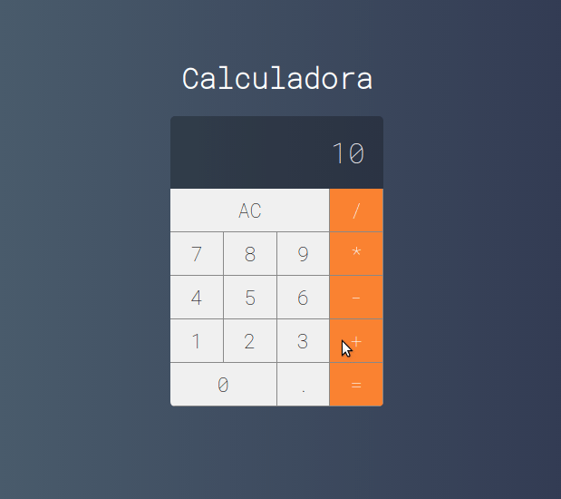

# Calculadora com ReactJS

---

> Este projeto foi realizado em acompanhamento ao curso de React + Redux ministrado dentro da plataforma Udemy, cujo idealizador é [COD3R](https://www.cod3r.com.br/)

## Descrição

O objetivo principal do projeto é o estudo dos fundamentos da biblioteca React utilizando-se de componentização, estilização com css vinculada a cada componente e manipulação de estados.

### `npm start`

Rode a aplicação em modo de desenvolvimento.  
Abra [http://localhost:3000](http://localhost:3000) para visualiza-la no navegador.
